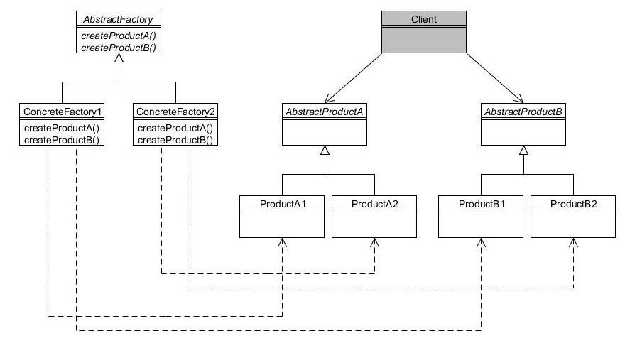

Abstract Factory Explained
--------------------------

Abstract Factory is a creational pattern.  It is all about families.  An abstract factory encapsulates a group of individual factories (call them concrete factory) that have a common theme without speficying their concrete classes.  The intent is to insulate the creation of objects from their usage and create these families of related objects.  Then when we want to add a new type, we can do it without changing the code in the base class, we just create another concrete factory.  

Here's the UML:

